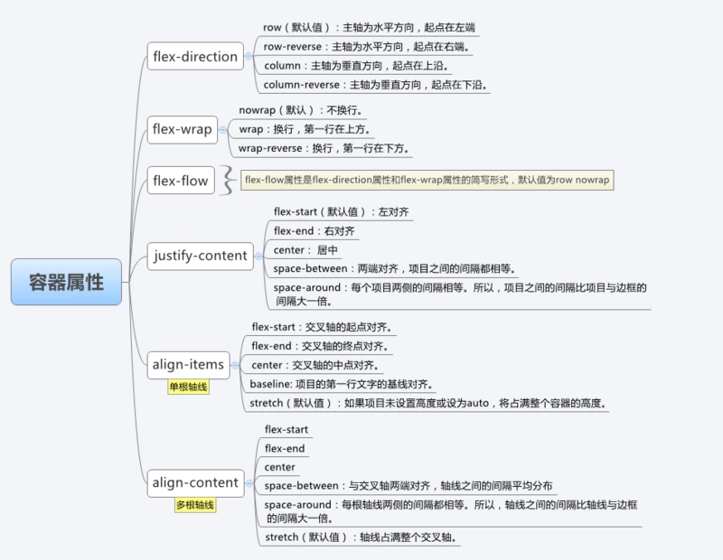

# CSS - Flex布局

### flex布局基本原理

- 通过给父盒子添加flex属性->控制子盒子的位置和排列方式

  ```css
  display: flex;
  ```

### 父盒子常用属性

- **flex-direction -> 设置主轴方向**[^设置为row则column为侧轴, 设置为column则row为侧轴]
  
  - [ ] row
  - [ ] row-reverse
  - [ ] column
  - [ ] column-reverse
  
- **justify-content -> 设置主轴上子元素排列方式**[^一定要先确定好主轴方向]
  
  - [ ] center
  - [ ] flex-start
  - [ ] flex-end
  - [ ] space-between    ->首尾元素贴边, 元素之间平分控件
  - [ ] space-around  ->元素平分空间, 首尾元素距离边框距离为元素之间的一半[^元素获得均匀margin]
  - [ ] space-evenly    ->元素平分空间, 首尾元素距离边框距离与元素之间的相等
  
- **flex-wrap ->设置子元素是否换行**
  
  - [ ] wrap
  - [ ] nowrap
  - [ ] wrap-reverse
  
- **align-items -> 设置侧轴上的子元素排列方式(适合元素只有一行的时候)**
  
  - [ ] center
  - [ ] flex-start
  - [ ] flex-end
  - [ ] baseline  ->设置所有元素盒子自己的侧轴对其
  - [ ] stretch    ->在侧轴方向上拉伸元素匹配侧轴高度[^需要不设置元素的高度]
  
- **align-content -> 设置侧轴上的子元素排列方式(适合元素有多行的时候)**
  
  - [ ] center
  - [ ] flex-start
  - [ ] flex-end
  - [ ] space-between
  - [ ] space-around
  - [ ] stretch    ->在侧轴方向上拉伸元素匹配侧轴高度[^需要不设置元素的高度]
  
- **flex-flow -> 复合属性, 相当于同时设置了flex-direction和flex-wrap**

    ```
    flex-flow: row wrap;
    ```


### 子元素设置属性

    - [ ] flex: [Number]    -> 子项占得份数
    - [ ] align-self: 属性同align-items    ->控制子项自己在侧轴上排列方式
    - [ ] order:  [Number]    -> 控制子项自己的(前后)排列顺序, 默认为0, 数值越小越靠前


